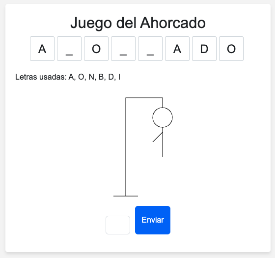

# Juego del Ahorcado

Este repositorio contiene un juego del Ahorcado creado en HTML, CSS y JavaScript. Puedes jugar al Ahorcado proporcionando la palabra que deseas adivinar mediante el parámetro GET `?palabra=` en la URL.

## Cómo jugar

1. Abre el archivo `index.html` en tu navegador.
2. Añade el parámetro GET `?palabra=` seguido de la palabra que deseas adivinar en la URL, por ejemplo: `index.html?palabra=example`.
3. Presiona Enter para cargar la página con la palabra seleccionada.
4. Introduce las letras que creas que están en la palabra en el cuadro de texto y haz clic en el botón "Enviar".
5. Si la letra pertenece a la palabra, se mostrará en la caja correspondiente. Si no, se pintará una parte del ahorcado en el lienzo.
6. Si adivinas la palabra antes de que se complete el dibujo del ahorcado, ganas. Si el dibujo del ahorcado se completa antes de que adivines la palabra, pierdes.

## Licencia

Este proyecto se publica bajo la licencia [Creative Commons Attribution 4.0 International (CC BY 4.0)](https://creativecommons.org/licenses/by/4.0/) .